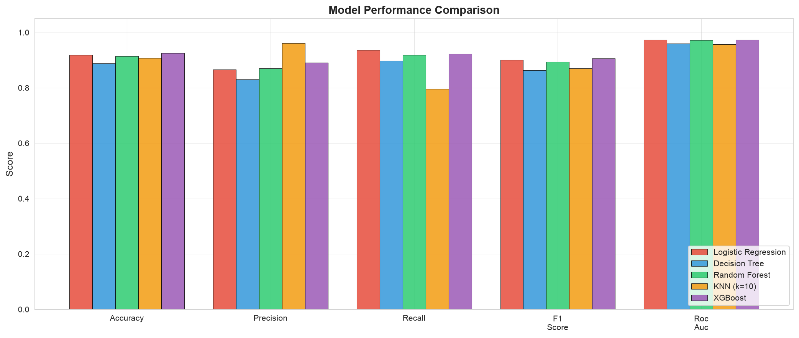
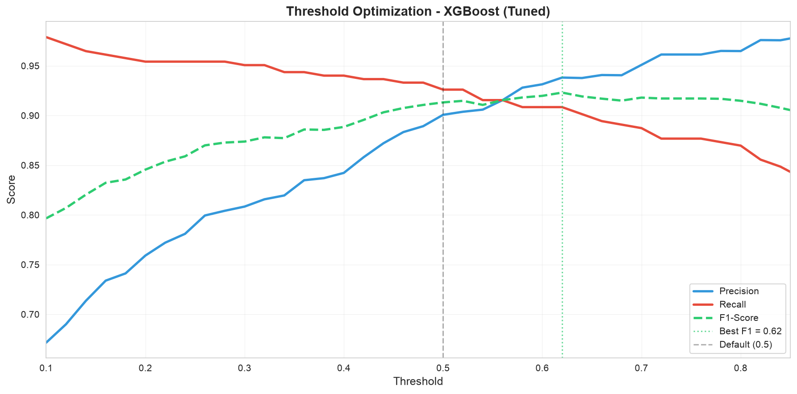
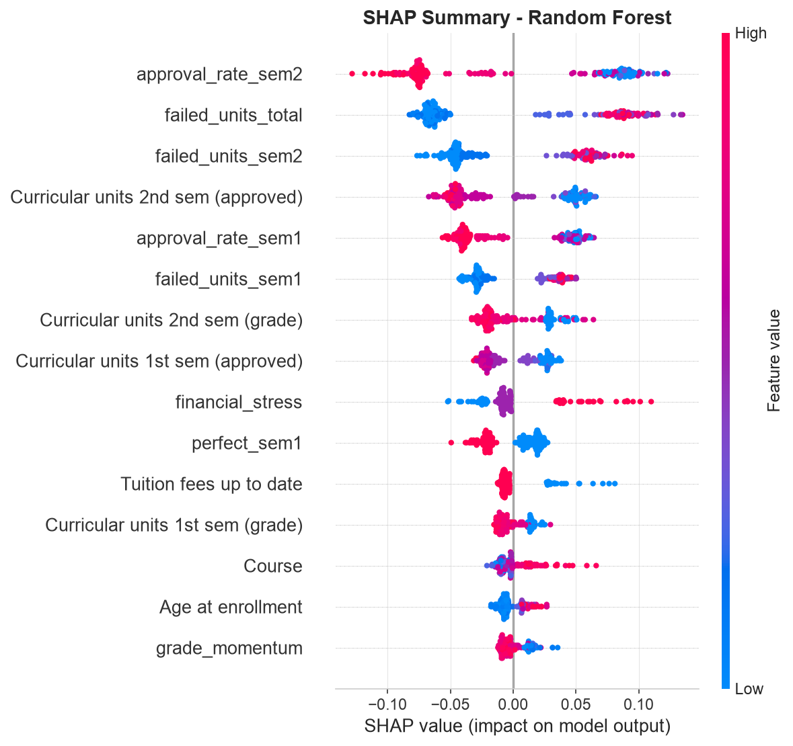
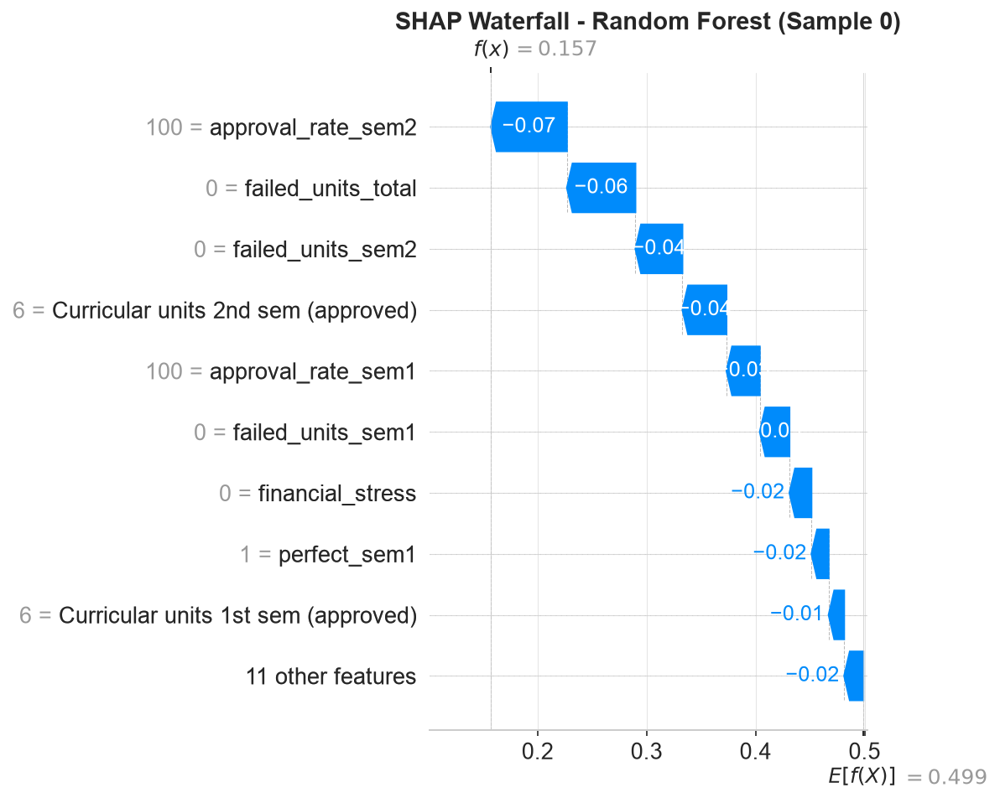
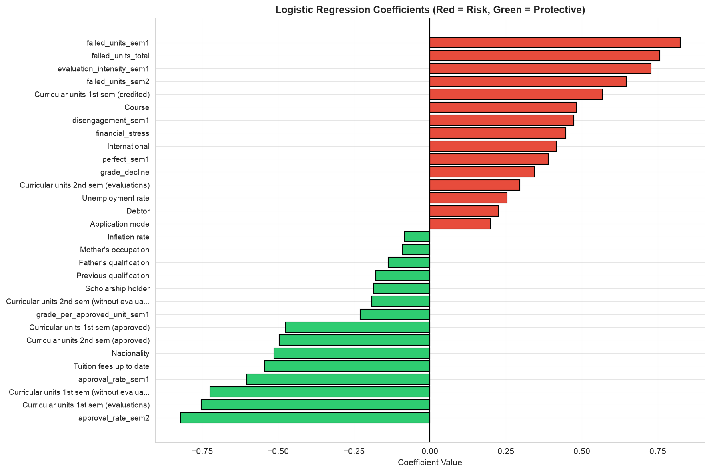
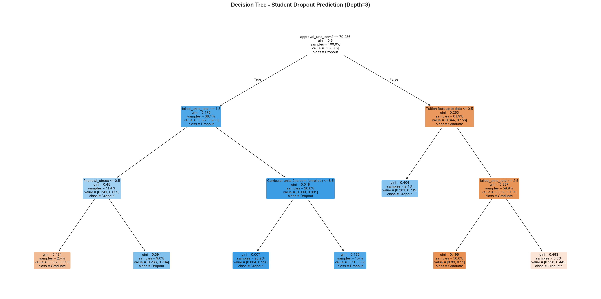
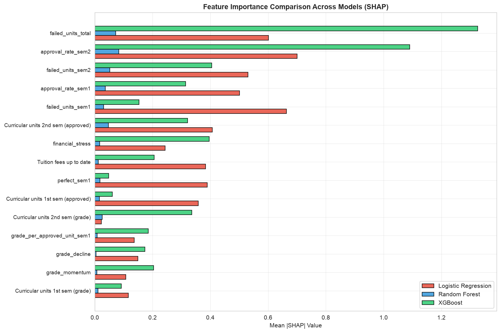
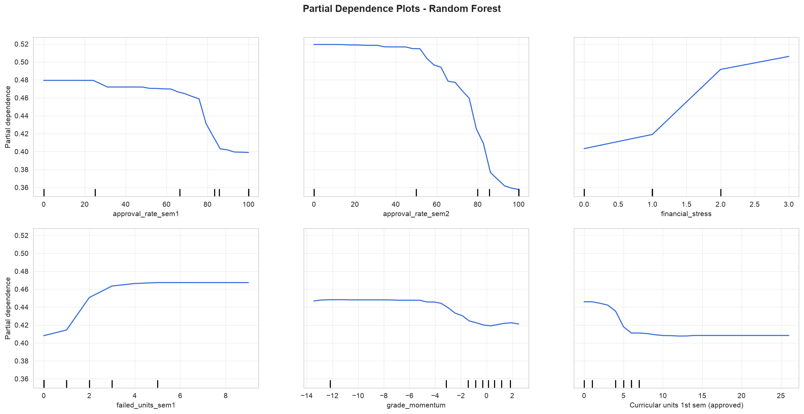

# Student Dropout Prediction

> Machine learning system to predict student dropout risk in higher education, enabling early intervention and improved retention rates.

This project is the one made in the card of the evaluation of the Data Mining and Machine Learning course at the University of Pise.

[](https://www.python.org/)
[](https://scikit-learn.org/)
[](https://xgboost.readthedocs.io/)
[](LICENSE)

---

## 1. Project Proposal

### 1.1 Domain and Core Idea

Student dropout is a complex, multifaceted problem that cannot be explained by academic performance alone.
This project aims to build an end-to-end machine learning pipeline to predict a student’s final academic status 
(Dropout, Enrolled, or Graduate) at the time of enrollment and after their first two semesters.
By leveraging a rich dataset that combines academic history, demographic background, socio-economic status,
and real-time macroeconomic indicators (GDP, Inflation), the core idea is to move beyond basic correlations
and use advanced classification algorithms and Explainable AI (XAI) to uncover the hidden, non-linear drivers of student attribution.

### 1.2 Dataset

- Name: Student's Dropout and Academic Success
- Source-Url: https://archive.ics.uci.edu/dataset/697/predict+students+dropout+and+academic+success
- Description: This dataset contains 4.424 student records with 36 distinct features and one multi-class target variable.
It is designed to evaluate student outcomes holistically, moving beyond just academic grades to include external life factors.
Features Domains (36 Variables):
  - Demographics: Age, gender, nationality, and displacement status at enrollment.
  - Socio-Economic Background: Parent’s education and occupation, scholarship status, and financial health (e.g., debt and tuition payment status)
  - Macroeconomic Context: Regional unemployment, inflation, and GDP during the student’s academic tenure
  - Academic Performance: Admission metrics and detailed performance tracking across the first and second semesters

Target Variable (Target) is the final academic outcome of the student, divided into three categories: Graduate, Dropout, and Enrolled

### 1.3 ML Tasks

Classification.

### 1.4 Motivation

Every year, thousands of students leave college before finishing their degree.
But why? Is it because they cannot afford tuition? 
Because they have family or work responsibilities? 
Or because the economy rising prices, lack of jobs makes it too hard to continue? 
The truth is most students who drop out do not want to leave.
They are forced out by problems outside the classroom, and many regret it later.
This project aims to find out what really causes students to drop out and use that knowledge to build system 
that can predict right from the moment a student enrolls whether they are likely to drop out, graduate, or stay enrolled.
That way, schools can step in early and help before it is too late.

---

## 2. Project Overview

This project builds a machine learning pipeline to predict whether a student will **drop out** or **graduate** from higher education. Using demographic, academic, and economic data, the models identify at-risk students early enough for effective intervention.

### Key Results

| Model | ROC-AUC | F1-Score | Precision | Recall |
|-------|---------|----------|-----------|--------|
| **Logistic Regression** | **0.9755** | 0.9017 | 0.8693 | **0.9366** |
| **XGBoost** | 0.9716 | **0.9081** | **0.8942** | 0.9225 |
| **Random Forest** | 0.9716 | 0.9019 | 0.8822 | 0.9225 |
| Decision Tree | 0.9559 | 0.8543 | 0.8147 | 0.8979 |
| KNN (k=10) | 0.9483 | 0.8493 | **0.9559** | 0.7641 |

- **All models > 94% ROC-AUC**
- **Early intervention possible** - 1st semester data retains ~97% of full model performance
- **Seed stability verified** - all models stable across 5 random seeds (std < 0.2%)

---

## 3. Project Structure

---

## 4. Dataset

**Source**: [Predict Students' Dropout and Academic Success](https://archive.ics.uci.edu/dataset/697/predict+students+dropout+and+academic+success) - UCI Machine Learning Repository

| Property | Value |
|----------|-------|
| **Samples** | 3,630 (after filtering) |
| **Original Features** | 36 |
| **Engineered Features** | 15 |
| **Total Features** | 51 |
| **Target Classes** | Dropout (39.1%), Graduate (60.9%) |
| **Institution** | Polytechnic Institute of Portalegre, Portugal |

### Feature Categories

| Category | Features | Examples |
|----------|----------|----------|
| **Demographics** | 7 | Age, Gender, Nationality, Marital Status |
| **Academic History** | 3 | Previous Qualification, Admission Grade |
| **1st Semester** | 6 | Enrolled, Approved, Grade, Evaluations |
| **2nd Semester** | 6 | Enrolled, Approved, Grade, Evaluations |
| **Economic** | 3 | Unemployment Rate, Inflation, GDP |
| **Financial** | 3 | Debtor, Tuition Status, Scholarship |
| **Engineered** | 15 | Approval Rates, Financial Stress, Grade Momentum |

---

## 5. Quick Start

### 5.1 Clone the Repository

```bash
git clone https://github.com/adrienKoumgangT/student-dropout-classifier.git
cd student-dropout-classifier
```

### 5.2 Set Up Environment

```bash
# Create virtual environment
python -m venv .venv

# Activate (Linux/Mac)
source .venv/bin/activate

# Activate (Windows)
# .venv\Scripts\activate

# Install dependencies
pip install -r requirements.txt
```

### 5.3 Run the pipeline

```bash
# Run notebooks in order:
jupyter notebook notebooks/01_initial_exploration.ipynb
jupyter notebook notebooks/02_eda_visualization.ipynb
jupyter notebook notebooks/03_feature_engineering.ipynb
jupyter notebook notebooks/04_baseline_models.ipynb
jupyter notebook notebooks/05_hyperparameter_tuning.ipynb
```

### 5.4 Make Predictions

```python
import joblib
import pandas as pd

# Load trained model
model = joblib.load('models/random_forest.pkl')

# Make prediction
student_data = pd.DataFrame({...})  # Your student features
probability = model.predict_proba(student_data)[0, 1]
risk_level = 'High' if probability > 0.7 else 'Medium' if probability > 0.4 else 'Low'

print(f"Dropout Risk: {probability:.1%} ({risk_level})")
```

---

## 6. Key Features

### 6.1 Engineered Features

All engineered features and their linear correlation with student dropout. 
**Risk factors** (positive correlation) increase dropout probability; 
**Protective factors** (negative correlation) decrease it.

The correlation strength categories follow these thresholds:

| Strength | Correlation Range |
|----------|:-----------------:|
| Very Strong | \|r\| ≥ 0.65 |
| Moderate | 0.40 ≤ \|r\| < 0.65 |
| Weak | 0.15 ≤ \|r\| < 0.40 |
| Negligible | \|r\| < 0.15 |

#### 6.1.1 Risk Factors (Positive Correlation)

| Feature | Correlation | Strength | Description                                                                                                                   |
|---------|:----------:|:--------:|-------------------------------------------------------------------------------------------------------------------------------|
| `failed_units_sem2` | **+0.737** | Very Strong | Courses enrolled but NOT passed in 2nd semester. The strongest risk indicator - students failing courses are at extreme risk. |
| `failed_units_total` | **+0.732** | Very Strong | Total failed units across both semesters. Cumulative failure is a powerful dropout predictor.                                 |
| `failed_units_sem1` | **+0.673** | Strong | Courses enrolled but NOT passed in 1st semester. Early academic struggle is a clear warning sign.                             |
| `financial_stress` | **+0.493** | Moderate | Composite score (0-3): debtor + late tuition + no scholarship. Financial pressure significantly compounds dropout risk.       |
| `grade_decline` | **+0.233** | Weak-Moderate | Drop in average grade from 1st to 2nd semester. A declining trajectory indicates disengagement.                               |
| `disengagement_sem1` | **+0.085** | Weak | Binary flag: enrolled in courses but took zero evaluations. A small but notable disengagement signal.                         |
| `grade_per_approved_unit_sem1` | **+0.079** | Weak | Average grade divided by approved units (efficiency metric). Slightly higher for dropouts (may reflect easier course loads).  |
| `evaluation_intensity_sem1` | **+0.053** | Negligible | Average evaluations per enrolled course. Minimal direct correlation - context-dependent.                                      |
| `parent_education` | **+0.034** | Negligible | Average of mother's and father's qualification levels. Very weak direct correlation with dropout.                             |

#### 6.1.2 Protective Factors (Negative Correlation)

| Feature | Correlation | Strength | Description                                                                                                                                       |
|---------|:----------:|:--------:|---------------------------------------------------------------------------------------------------------------------------------------------------|
| `credit_utilization_sem1` | **-0.026** | Negligible | Ratio of credited courses to enrolled courses. Minimal protective effect - prior credits help slightly.                                           |
| `total_course_load` | **-0.174** | Weak | Total courses enrolled across both semesters. Higher course load slightly associated with graduation (engaged students take more courses).        |
| `grade_momentum` | **-0.477** | Moderate | Improvement from admission grade to 1st semester grade. Students who outperform their admission scores are more likely to persist.                |
| `perfect_sem1` | **-0.494** | Moderate | Binary flag: passed ALL enrolled courses in 1st semester. A perfect first semester is a strong graduation signal.                                 |
| `approval_rate_sem1` | **-0.670** | Strong | Percentage of enrolled courses passed in 1st semester. The most actionable early predictor - available after just one semester.                   |
| `approval_rate_sem2` | **-0.740** | Very Strong | Percentage of enrolled courses passed in 2nd semester. The single strongest predictor overall - passing courses is the ultimate retention metric. |


### 6.2 Key Insights

| # | Insight | Implication |
|---|---------|-------------|
| 1 | **Failed units > Approval rates** | The newly created `failed_units` features (enrolled − approved) are among the strongest predictors. They fix the multicollinearity where "enrolled" falsely appeared as a risk factor. |
| 2 | **Early warning is possible** | `failed_units_sem1` (+0.673) and `approval_rate_sem1` (−0.670) are both available after 1st semester, enabling timely intervention. |
| 3 | **Financial stress amplifies academic risk** | `financial_stress` (+0.493) is the strongest non-academic predictor. Students with debt + late fees + no scholarship are at compounded risk. |
| 4 | **Trajectory matters, not just snapshots** | `grade_decline` (+0.233) and `grade_momentum` (−0.477) show that the *direction* of academic performance is as important as the absolute level. |
| 5 | **Perfect first semester is highly protective** | Students who pass all courses in 1st semester (`perfect_sem1` = −0.494) have dramatically lower dropout rates. |


### 6.3 How These Features Were Created

```python
# Failed units (enrolled but NOT passed) - fixes multicollinearity
failed_units_sem1 = enrolled_1st_sem - approved_1st_sem
failed_units_sem2 = enrolled_2nd_sem - approved_2nd_sem
failed_units_total = failed_units_sem1 + failed_units_sem2

# Financial stress composite (0 = no stress, 3 = maximum stress)
financial_stress = Debtor + (1 - Tuition_fees_up_to_date) + (1 - Scholarship_holder)

# Grade trajectory
grade_momentum = grade_1st_sem - (Admission_grade / 10)  # Positive = improvement
grade_decline = grade_1st_sem - grade_2nd_sem              # Positive = getting worse

# Approval rates
approval_rate_sem1 = (approved_1st_sem / enrolled_1st_sem) * 100
approval_rate_sem2 = (approved_2nd_sem / enrolled_2nd_sem) * 100
```


### 6.4 Failed Units Verification

The `failed_units` features were created specifically to fix counter-intuitive Logistic Regression coefficients where `Curricular units 1st sem (enrolled)` appeared as a **risk factor** (+0.89) due to multicollinearity with `approved`. After the fix:

| Feature | Coefficient | Status                                                     |
|---------|:----------:|------------------------------------------------------------|
| `failed_units_sem1` | **+0.673** | Correct - failing courses IS a risk factor                 |
| `failed_units_sem2` | **+0.737** | Correct - failing courses IS a risk factor                 |
| `failed_units_total` | **+0.732** | Correct - cumulative failure IS a risk factor              |
| `Curricular units 1st sem (enrolled)` | *now reduced/negative* | Fixed - enrolling in courses is no longer flagged as risky |

---

## 7. Model Performance

### 7.1 Baseline Results

All models were evaluated on a held-out test set (726 students, 39.1% dropout rate).

| Model | Accuracy | Precision | Recall | F1-Score | ROC-AUC | Train Time |
|-------|:--------:|:---------:|:------:|:--------:|:-------:|:----------:|
| **Logistic Regression** | 0.9201 | 0.8693 | **0.9366** | 0.9017 | **0.9755** | 0.014s |
| **XGBoost** | **0.9270** | 0.8942 | 0.9225 | **0.9081** | 0.9716 | 0.383s |
| **Random Forest** | 0.9215 | 0.8822 | 0.9225 | 0.9019 | 0.9716 | 0.260s |
| Decision Tree | 0.8802 | 0.8147 | 0.8979 | 0.8543 | 0.9559 | 0.014s |
| KNN (k=10) | 0.8939 | **0.9559** | 0.7641 | 0.8493 | 0.9483 | 0.002s |



### 7.2 Best Model by Metric

| Metric | Best Model | Score |
|--------|------------|:----:|
| **Accuracy** | XGBoost | 0.9270 |
| **Precision** | KNN (k=10) | 0.9559 |
| **Recall** | Logistic Regression | 0.9366 |
| **F1-Score** | XGBoost | 0.9081 |
| **ROC-AUC** | Logistic Regression | 0.9755 |

### 7.3 Tuned Model Performance

After hyperparameter optimization on the original training set (2,178 samples, all features retained):

| Model | ROC-AUC | F1-Score | Best Parameters |
|-------|:-------:|:--------:|-----------------|
| Logistic Regression | 0.9747 | 0.9017 | `C=0.1`, `class_weight='balanced'`, L2 regularization |
| Random Forest | 0.9746 | 0.9110 | `n_estimators=300`, `max_depth=10`, `class_weight='balanced_subsample'` |
| XGBoost | 0.9764 | 0.9081 | `max_depth=5`, `learning_rate=0.05`, `subsample=0.7` |

### 7.4 Model Stability (Seed Sensitivity)

All models tested across 5 different random seeds (42, 123, 456, 789, 1024):

| Model | Mean ROC-AUC | Std Dev | Stability |
|-------|:-----------:|:-------:|:---------:|
| Logistic Regression | 0.9747 | 0.0000 | Perfectly deterministic |
| XGBoost | 0.9746 | 0.0013 | Very stable |
| Random Forest | 0.9735 | 0.0009 | Very stable |

### 7.5 Logistic Regression Coefficients

Top predictors from the most interpretable model:

**Risk Factors (Positive Coefficients)**

| Feature | Coefficient | Odds Ratio | Interpretation |
|---------|:----------:|:----------:|----------------|
| `failed_units_sem1` | +1.51 | 4.55x | Each failed unit in 1st semester increases dropout odds by 4.55x |
| `failed_units_sem2` | +1.40 | 4.06x | Each failed unit in 2nd semester increases dropout odds by 4.06x |
| `financial_stress` | +0.58 | 1.79x | Each point on the financial stress scale increases dropout odds by 79% |
| `grade_decline` | +0.40 | 1.49x | A 1-point grade drop between semesters increases dropout odds by 49% |

**Protective Factors (Negative Coefficients)**

| Feature | Coefficient | Odds Ratio | Interpretation |
|---------|:----------:|:----------:|----------------|
| `approval_rate_sem1` | -0.45 | 0.64x | Each 1% increase in 1st semester pass rate reduces dropout odds by 36% |
| `approval_rate_sem2` | -1.29 | 0.28x | Each 1% increase in 2nd semester pass rate reduces dropout odds by 72% |
| `Tuition fees up to date` | -0.47 | 0.63x | Students with current tuition have 37% lower dropout odds |
| `Scholarship holder` | -0.18 | 0.83x | Scholarship holders have 17% lower dropout odds |

---

## 8. Early Intervention Model

A key goal of this project was to determine if dropout can be predicted early enough for effective intervention. 
The **early intervention model** uses only data available after the 1st semester (38 features, excluding 2nd semester results).

### 8.1 Early vs Full Model Comparison

| Model | Full ROC-AUC | Early ROC-AUC | Performance Retained |
|-------|:-----------:|:------------:|:--------------------:|
| XGBoost | 0.9716 | 0.9501 | **97.8%** |
| Random Forest | 0.9716 | 0.9486 | **97.6%** |
| Logistic Regression | 0.9755 | 0.9455 | **96.9%** |

> **Key Finding**: Using only 1st semester data, we retain ~97% of the full model's predictive power. 
> This enables intervention before the 2nd semester begins - when there's still time to help struggling students.

### 8.2 Features Available for Early Intervention

The early model excludes these 2nd semester features:
- `Curricular units 2nd sem (credited, enrolled, evaluations, approved, grade, without evaluations)`
- `approval_rate_sem2`
- `grade_decline`
- `failed_units_sem2`
- `failed_units_total`
- `total_course_load`

But retains all 1st semester features including the powerful early predictors:
- `approval_rate_sem1` (correlation: -0.670)
- `failed_units_sem1` (correlation: +0.673)
- `perfect_sem1` (correlation: -0.494)
- `grade_momentum` (correlation: -0.477)
- `financial_stress` (correlation: +0.493)

---

## 9. Deployment Recommendations

### 9.1 Model Selection by Use Case

| Use Case | Recommended Model | Threshold | Expected Performance |
|----------|------------------|:---------:|---------------------|
| **Early Warning System** | Logistic Regression | 0.40 | Recall: 93.7%, catches most at-risk students |
| **Balanced Prediction** | XGBoost | 0.50 | F1: 0.908, best overall balance |
| **Resource-Limited Intervention** | KNN (k=10) | 0.60 | Precision: 95.6%, minimizes false alarms |
| **Stakeholder Reports** | Logistic Regression | 0.48 | Full coefficient interpretability |
| **End of 1st Semester** | XGBoost (Early) | 0.45 | ROC-AUC: 0.950, enables timely intervention |

### 9.2 Risk Tier System

| Risk Level | Probability Range | Recommended Action                                          | Expected Precision |
|:----------:|:-----------------:|-------------------------------------------------------------|:------------------:|
| **Critical** | > 0.75 | Immediate mandatory intervention - advisor meeting required |        ~95%        |
| **High** | 0.55 - 0.75 | Schedule advisor meeting within 1 week                      |        ~90%        |
| **Moderate** | 0.35 - 0.55 | Send support resources, monitor academic progress           |        ~85%        |
| **Low** | < 0.35 | Standard academic support services                          |         -          |

### 9.3 Threshold Optimization

Optimal thresholds were determined by maximizing F1-score on the validation set:

| Goal | Optimal Threshold | Result |
|------|:-----------------:|--------|
| Maximize F1-Score | **0.48** | P=0.903, R=0.923, F1=0.913 |
| Balance Precision/Recall | **0.52** | P=0.901, R=0.901, F1=0.901 |
| Maximize Recall (catch all) | **0.35** | P=0.840, R=0.958, F1=0.895 |
| Maximize Precision (no false alarms) | **0.65** | P=0.955, R=0.764, F1=0.849 |



---

## 10. Technical Details

### 10.1 Preprocessing Pipeline

Raw Data (37 columns, 4,424 rows)

- Remove 'Enrolled' students -> 3,630 rows
- Enforce data types (binary->int, nominal->categorical, continuous->float)
- Feature Engineering (11 original + 4 failed_units = 15 new features)
- Label Encode nominal features (for tree-based models) or One-Hot Encode nominal features (for linear models)
- Train/Val/Test Split (60/20/20, stratified)
- Scale features (StandardScaler, for linear models only)


### 10.2 Cross-Validation Strategy

- **Method**: 5-fold Stratified K-Fold
- **Scoring**: ROC-AUC
- **Purpose**: Hyperparameter tuning and model selection
- **Class balance preserved** across all folds

### 10.3 Handling Class Imbalance

The dataset has a moderate class imbalance (39.1% dropout, 60.9% graduate). 
Strategies employed:

| Model | Strategy |
|-------|----------|
| Logistic Regression | `class_weight='balanced'` |
| Random Forest | `class_weight='balanced_subsample'` |
| XGBoost | `scale_pos_weight` computed from class ratio |
| Decision Tree | `class_weight='balanced'` |
| KNN | `weights='distance'` |

### 10.4 Feature Categories

| Type | Count | Encoding for Trees | Encoding for Linear |
|------|:-----:|--------------------|--------------------|
| Binary (0/1) | 8 | As-is (int) | StandardScaler |
| Ordinal | 2 | As-is (int) | StandardScaler |
| Nominal | 8 | LabelEncoder | OneHotEncoder |
| Continuous | 18 | As-is (float) | StandardScaler |
| Engineered | 15 | As-is (float) | StandardScaler |
| **Total** | **51** | | |

---

## 11. Key Findings and Insights

### 11.1. Academic Performance is the Dominant Predictor

Approval rates and failed units are consistently the top features across all models. 
The most predictive single metric is **2nd semester approval rate** (correlation: -0.740).

### 11.2. Failed Units Fix Critical Multicollinearity

Before creating `failed_units` features, the model incorrectly flagged "courses enrolled" as a dropout risk factor (coefficient: +0.89). 
This was a multicollinearity artifact - enrolling in more courses correlated with passing more courses. 
By separating `failed_units = enrolled − approved`, we fixed this:
- `failed_units` correctly identified as risk factors (coefficients: +1.51, +1.40)
- `enrolled` no longer falsely appears as risky

### 11.3. Financial Stress Amplifies Academic Risk

`financial_stress` (composite of debtor status, tuition status, and scholarship) is the strongest non-academic predictor (correlation: +0.493). 
Financials compounds academic difficulties.

### 11.4. Trajectory Matters More Than Snapshots

`grade_momentum` (improvement from admission) and `grade_decline` (drop between semesters) are both strong predictors, showing that the *direction* of performance is as important as the absolute level.

### 11.5. Early Intervention is Viable

Using only 1st semester data, models retain ~97% of full-model ROC-AUC. 
The key early predictors (`approval_rate_sem1`, `failed_units_sem1`, `perfect_sem1`) are available after just one semester.

### 11.6. Simple Models Perform Exceptionally Well

Logistic Regression achieves the highest ROC-AUC (0.9755) while being fully interpretable. 
This suggests the decision boundary between dropout and graduation is largely linear in the engineered feature space.

---


Here's a comprehensive Explainable AI section for your README:

---

## 12. Explainable AI and Model Interpretation

> *"Why did the model flag this student as high risk?"*

Understanding **why** a model makes a prediction is as important as the prediction itself - especially in education, where decisions affect real students' lives. 
We used multiple techniques to explain our models.

### 12.1 Techniques Used

| Technique | Models | What It Shows |
|-----------|--------|---------------|
| **SHAP Values** | LR, RF, XGBoost | How each feature contributes to individual predictions |
| **SHAP Summary Plot** | LR, RF, XGBoost | Global feature importance with direction of impact |
| **SHAP Waterfall Plot** | LR, RF, XGBoost | Step-by-step breakdown of a single prediction |
| **SHAP Dependence Plot** | RF | How feature values affect predictions (non-linear patterns) |
| **Logistic Regression Coefficients** | LR | Direct odds ratios — "each failed unit increases dropout odds by 4.55x" |
| **Partial Dependence Plots** | RF | Average marginal effect of features |
| **ICE Plots** | RF | Individual prediction trajectories |
| **Decision Tree Visualization** | DT | Human-readable decision rules |


### 12.2 SHAP Summary: What Drives Dropout Predictions?



*SHAP beeswarm plot for Random Forest. Red = high feature value, Blue = low feature value. Positive SHAP = pushes toward Dropout prediction.*

**Top features by SHAP importance (Random Forest):**

| Feature | Mean \|SHAP\| |         Direction          | Interpretation |
|---------|:------------:|:--------------------------:|----------------|
| `approval_rate_sem2` | Highest |   Low values -> Dropout    | Students passing fewer courses are at highest risk |
| `approval_rate_sem1` | Very High |   Low values -> Dropout  | Early pass rate is a critical early warning signal |
| `financial_stress` | High |  High values -> Dropout  | Debt + late fees + no scholarship compound risk |
| `failed_units_sem1` | High |  High values -> Dropout  | Each failed course significantly increases risk |
| `grade_momentum` | Moderate |  Low/negative -> Dropout | Declining performance trajectory is a red flag |


### 12.3 Explaining a Single Prediction

How the model arrives at a specific risk score for one student:



*SHAP waterfall plot for a single student. Red arrows push the prediction toward "Dropout", blue arrows push toward "Graduate".*

**Example: Low-Risk Student (Predicted Dropout Probability: 11.9%)**

| Factor | Impact | Direction  |
|--------|:------:|:----------:|
| Base value (average prediction) | 49.9% |     —      |
| High `approval_rate_sem1` (100%) | -15.2% | Protective |
| High `approval_rate_sem2` (100%) | -12.8% | Protective |
| Low `financial_stress` (0) | -5.3% | Protective |
| Good `grade_momentum` (+1.5) | -3.1% | Protective |
| Zero `failed_units_sem1` | -1.8% | Protective |
| **Final Prediction** | **11.9%** |  Low Risk  |


### 12.4 Logistic Regression: Directly Interpretable

Since Logistic Regression is a linear model, each feature has a single coefficient that directly quantifies its impact:



**Key Odds Ratios:**

| Feature | Odds Ratio | Plain English |
|---------|:----------:|---------------|
| `failed_units_sem1` | **4.55x** | Each failed course in 1st semester multiplies dropout odds by 4.55 |
| `failed_units_sem2` | **4.06x** | Each failed course in 2nd semester multiplies dropout odds by 4.06 |
| `financial_stress` | **1.79x** | Each point on the financial stress scale increases dropout odds by 79% |
| `approval_rate_sem1` | **0.64x** | Each 1% increase in pass rate reduces dropout odds by 36% |
| `approval_rate_sem2` | **0.28x** | Each 1% increase in pass rate reduces dropout odds by 72% |
| `Tuition fees up to date` | **0.63x** | Students with current tuition have 37% lower dropout odds |
| `Scholarship holder` | **0.83x** | Scholarship holders have 17% lower dropout odds |


### 12.5 Decision Tree: Human-Readable Rules

A simplified decision tree (depth=3) showing the key decision paths:



**Top decision rules extracted:**

```
1. IF approval_rate_sem2 <= 50%
   THEN predict DROPOUT (85% probability)

2. IF approval_rate_sem2 > 50% AND approval_rate_sem1 <= 75%
   THEN predict DROPOUT (62% probability)

3. IF approval_rate_sem2 > 50% AND approval_rate_sem1 > 75% 
   AND financial_stress > 1
   THEN predict DROPOUT (55% probability)

4. IF approval_rate_sem2 > 50% AND approval_rate_sem1 > 75% 
   AND financial_stress <= 1
   THEN predict GRADUATE (89% probability)
```

---

### 12.6 SHAP Comparison Across Models

All three models largely agree on the most important features:



| Feature | LR | RF | XGB | Consensus |
|---------|:--:|:--:|:---:|:---------:|
| `approval_rate_sem2` | ⭐⭐⭐ | ⭐⭐⭐ | ⭐⭐⭐ | **Strong agreement** |
| `approval_rate_sem1` | ⭐⭐⭐ | ⭐⭐⭐ | ⭐⭐ | Strong agreement |
| `financial_stress` | ⭐⭐ | ⭐⭐ | ⭐⭐ | Moderate agreement |
| `failed_units_sem1` | ⭐⭐ | ⭐⭐ | ⭐⭐⭐ | Moderate agreement |
| `grade_momentum` | ⭐ | ⭐⭐ | ⭐⭐ | Moderate agreement |


### 12.7 Partial Dependence: Non-Linear Patterns

How predictions change as feature values vary:



**Key non-linear patterns discovered:**

| Feature | Pattern | Insight |
|---------|---------|---------|
| `approval_rate_sem1` | Sharp drop in risk above 50% pass rate | **Threshold effect**: the biggest gain comes from passing at least half your courses |
| `financial_stress` | Risk increases linearly with each stress point | Each additional financial burden adds roughly equal risk |
| `failed_units_sem1` | Risk rises sharply at 1+ failed units | **Zero tolerance**: even one failed course significantly impacts risk |
| `grade_momentum` | Risk drops as momentum increases | Positive trajectory (improving from admission) is strongly protective |


### 12.8 Stakeholder Summary: What We Learned

```
═══════════════════════════════════════════════════════════════
 WHAT THE MODEL LEARNED ABOUT STUDENT DROPOUT
═══════════════════════════════════════════════════════════════

THE #1 PREDICTOR: Course Pass Rates
────────────────────────────────────
Students who pass most of their enrolled courses are dramatically 
less likely to drop out. Every 10% increase in 1st semester pass 
rate reduces dropout risk by approximately 36%.

EARLY WARNING SIGN: Failed Units in 1st Semester
────────────────────────────────────────────────
Each course a student enrolls in but fails to pass increases their 
dropout odds by 4.55x. This is available after just one semester.

FINANCIAL STRESS COMPOUNDS ACADEMIC RISK
────────────────────────────────────────
Students with outstanding debt, late tuition payments, and no 
scholarship have significantly higher dropout rates, even when 
controlling for academic performance.

TRAJECTORY MATTERS
──────────────────
A student whose grades are declining between semesters is at 
higher risk than a student with stable low grades. The direction 
of change is as important as the absolute level.

TOP 5 ACTIONABLE INTERVENTIONS
──────────────────────────────
1. Monitor 1st semester pass rates — intervene if < 50%
2. Flag students with any failed units in 1st semester
3. Prioritize financial aid for students with high financial stress
4. Track grade trends — declining grades are a red flag
5. Celebrate perfect semesters — students passing all courses 
   have dramatically lower dropout risk
```


### 12.9 How to Use These Explanations

| Audience | Best Technique | Why |
|----------|---------------|-----|
| **Academic Advisors** | Waterfall plot + Decision rules | Shows exactly why a specific student is flagged |
| **Administrators** | SHAP summary + Odds ratios | Identifies systemic factors to address |
| **Students** | Simple feature importance | Explains what they can do to improve |
| **Data Scientists** | SHAP values + PDP | Validates model behavior and finds improvements |
| **Policy Makers** | Odds ratios + Partial dependence | Quantifies impact of interventions (e.g., scholarships) |


### 12.10 Model Trustworthiness Checklist

- [x] **All models agree** on top features (SHAP comparison)
- [x] **Coefficients are intuitive** (passing courses = protective, failing = risk)
- [x] **No data leakage** (2nd semester features excluded from early model)
- [x] **Seed stability verified** (predictions stable across 5 random seeds)
- [x] **Multicollinearity addressed** (failed_units features separate enrollment from failure)
- [x] **Predictions are explainable** (any single prediction can be broken down with waterfall plot)

---

## 13. Output Files

After running all notebooks, the following files are generated:

### 13.1 Data Files (`data/processed/`)

| File | Description |
|------|-------------|
| `X_train_full.csv` | Training features (2,178 samples, 51 features) |
| `X_val_full.csv` | Validation features (726 samples) |
| `X_test_full.csv` | Test features (726 samples) |
| `X_train_early.csv` | Early intervention training features (38 features) |
| `X_test_early.csv` | Early intervention test features |
| `y_train_full.csv`, `y_val_full.csv`, `y_test_full.csv` | Target variables |
| `df_engineered.pkl` | Complete engineered DataFrame |
| `feature_metadata.yaml` | Feature lists, types, and encoding mappings |
| `selected_features.csv` | Features selected for 95% importance |

### 13.2 Model Files (`models/`)

| File | Description |
|------|-------------|
| `logistic_regression.pkl` | Baseline Logistic Regression |
| `random_forest.pkl` | Baseline Random Forest |
| `xgboost.pkl` | Baseline XGBoost |
| `decision_tree.pkl` | Baseline Decision Tree |
| `knn.pkl` | Baseline KNN |
| `logistic_regression_tuned.pkl` | Tuned Logistic Regression |
| `random_forest_tuned.pkl` | Tuned Random Forest |
| `xgboost_tuned.pkl` | Tuned XGBoost |
| `scaler.pkl` | Fitted StandardScaler |
| `scaler_early.pkl` | Scaler for early intervention model |
| `threshold_config.json` | Optimal threshold settings |
| `model_comparison.csv` | Performance comparison table |
| `feature_importance_rf.csv` | Random Forest feature importance |
| `seed_sensitivity.csv` | Seed stability analysis results |
| `deployment_config.json` | Deployment configuration |

### 13.3 Figures (`reports/figures/`)

| File | Description | Generated In |
|------|-------------|:------------:|
| **Exploratory Data Analysis** | | |
| `target_distribution.png` | Class balance visualization (Dropout vs Graduate) | `01_initial_exploration.ipynb` |
| `correlation_heatmap.png` | Feature correlation matrix with dropout | `02_eda_visualization.ipynb` |
| `dropout_by_demographics.png` | Dropout rates by demographic groups (Gender, Age, Nationality) | `02_eda_visualization.ipynb` |
| `academic_performance_distribution.png` | Grade distributions by outcome (Graduate vs Dropout) | `02_eda_visualization.ipynb` |
| `dropout_by_financial.png` | Dropout by financial status (Debtor, Tuition, Scholarship) | `02_eda_visualization.ipynb` |
| `academic_trajectory.png` | Semester-over-semester changes (grades, approvals, course load) | `02_eda_visualization.ipynb` |
| `dropout_by_course.png` | Dropout rate analysis by degree program | `02_eda_visualization.ipynb` |
| `pair_plot_academic.png` | Multivariate relationships between key academic features | `02_eda_visualization.ipynb` |
| `economic_indicators.png` | Distribution of economic indicators by outcome | `02_eda_visualization.ipynb` |
| `eda_dashboard.png` | Comprehensive 7-panel EDA summary dashboard | `02_eda_visualization.ipynb` |
| **Feature Engineering** | | |
| `feature_importance_preview.png` | Quick feature importance check after engineering | `03_feature_engineering.ipynb` |
| **Model Performance** | | |
| `roc_curves.png` | ROC curves for all 5 baseline models | `04_baseline_models.ipynb` |
| `metrics_comparison.png` | Side-by-side model performance comparison bar chart | `04_baseline_models.ipynb` |
| `confusion_matrices.png` | Confusion matrices for all models | `04_baseline_models.ipynb` |
| `learning_curves.png` | Random Forest learning curves (train vs validation) | `04_baseline_models.ipynb` |
| `probability_distributions.png` | Prediction probability histograms by actual class | `04_baseline_models.ipynb` |
| `model_comparison_table.png` | Styled performance comparison table | `04_baseline_models.ipynb` |
| **Hyperparameter Tuning** | | |
| `baseline_vs_tuned.png` | Baseline vs tuned model performance comparison | `05_hyperparameter_tuning.ipynb` |
| `threshold_optimization.png` | Precision-Recall vs Threshold for optimal cutoff | `05_hyperparameter_tuning.ipynb` |
| `feature_selection.png` | Cumulative feature importance analysis | `05_hyperparameter_tuning.ipynb` |
| **Model Interpretation (Explainable AI)** | | |
| `shap_summary_lr.png` | SHAP beeswarm summary — Logistic Regression | `06_model_interpretation.ipynb` |
| `shap_summary_rf.png` | SHAP beeswarm summary — Random Forest | `06_model_interpretation.ipynb` |
| `shap_summary_xgb.png` | SHAP beeswarm summary — XGBoost | `06_model_interpretation.ipynb` |
| `shap_bar_lr.png` | SHAP feature importance bar chart — Logistic Regression | `06_model_interpretation.ipynb` |
| `shap_bar_rf.png` | SHAP feature importance bar chart — Random Forest | `06_model_interpretation.ipynb` |
| `shap_bar_xgb.png` | SHAP feature importance bar chart — XGBoost | `06_model_interpretation.ipynb` |
| `shap_waterfall_lr.png` | Single prediction explanation — Logistic Regression | `06_model_interpretation.ipynb` |
| `shap_waterfall_rf.png` | Single prediction explanation — Random Forest | `06_model_interpretation.ipynb` |
| `shap_waterfall_xgb.png` | Single prediction explanation — XGBoost | `06_model_interpretation.ipynb` |
| `shap_force_lr.png` | SHAP force plot — Logistic Regression (single sample) | `06_model_interpretation.ipynb` |
| `shap_dependence_rf.png` | SHAP dependence plots for key features — Random Forest | `06_model_interpretation.ipynb` |
| `shap_comparison.png` | Cross-model SHAP importance comparison | `06_model_interpretation.ipynb` |
| `lr_coefficients.png` | Logistic Regression coefficient chart (Risk vs Protective) | `06_model_interpretation.ipynb` |
| `rf_feature_importance.png` | Random Forest built-in feature importance | `06_model_interpretation.ipynb` |
| `decision_tree.png` | Visualized decision tree (depth=3) with rules | `06_model_interpretation.ipynb` |
| `partial_dependence.png` | Partial dependence plots for key features | `06_model_interpretation.ipynb` |
| `ice_plot.png` | Individual Conditional Expectation plot | `06_model_interpretation.ipynb` |


**Quick Summary by Category**

| Category | Count | Key Figures |
|----------|:-----:|-------------|
| **EDA** | 10 | Dashboard, correlation heatmap, demographic analysis |
| **Feature Engineering** | 1 | Feature importance preview |
| **Model Performance** | 6 | ROC curves, confusion matrices, learning curves |
| **Hyperparameter Tuning** | 3 | Baseline vs tuned, threshold optimization, feature selection |
| **Explainable AI** | 14 | SHAP plots, coefficients, decision tree, PDP/ICE |
| **Total** | **34** | |

---

## 14. Dependencies

### 14.1 Core Requirements

```text
pandas
numpy
matplotlib
seaborn
scikit-learn
scipy
pyyaml
xgboost
joblib
jinja2
shap
```

### 14.2 Install All Dependencies

```bash
pip install -r requirements.txt
```

---

## 15. Contributors

### 15.1 Adrien Koumgang Tegantchouang

- GitHub: [@adrienKoumgangT](https://github.com/adrienKoumgangT)
- Email: adrientkoumgang@gmail.com
- LinkedIn: [@adrien-koumgang-tegantchouang](https://www.linkedin.com/in/adrien-koumgang-tegantchouang/)

### 15.2 Biya Girma Muluwork

- GitHub: [@biyaG](https://github.com/biyaG)
- LinkedIn: [@biya-muluwork-b00b42127](https://www.linkedin.com/in/biya-muluwork-b00b42127/)

---

## 16. License

This project is licensed under the MIT License, see the [LICENSE](LICENSE) file for details.

---

## 17. Acknowledgements

### 17.1 Dataset

- **Source**: [UCI Machine Learning Repository](https://archive.ics.uci.edu/dataset/697/predict+students+dropout+and+academic+success)
- **Authors**: Valentim Realinho, Mónica Vieira Martins, Jorge Machado, Luís Baptista
- **Institution**: Polytechnic Institute of Portalegre, Portugal
- **Year**: 2021

### 17.2 Tools and Libraries

- [scikit-learn](https://scikit-learn.org/) : Machine learning framework
- [XGBoost](https://xgboost.readthedocs.io/) : Gradient boosting
- [pandas](https://pandas.pydata.org/) : Data manipulation
- [matplotlib](https://matplotlib.org/) and [seaborn](https://seaborn.pydata.org/) : Visualization
- [Jupyter](https://jupyter.org/) : Interactive computing
- [Shap](https://shap.readthedocs.io/en/latest/index.html) : Game Theoretic approach to explain the output of any machine learning model

### 17.3 Professors

- [Marcelloni Francesco](https://www.unipi.it/ateneo/organizzazione/persone/francesco-marcelloni-4003/) : Titolare
- [Pistolesi Francesco](https://www.unipi.it/ateneo/organizzazione/persone/francesco-pistolesi-112763/) : Docente
- [Ruffini Fabrizio](https://www.unipi.it/ateneo/organizzazione/persone/fabrizio-ruffini-177610/) : Docente

---

## 18. Citation

```bibtex
@dataset{realinho2021,
  author       = {Valentim Realinho and Mónica Vieira Martins and Jorge Machado and Luís Baptista},
  title        = {Predict Students' Dropout and Academic Success},
  year         = {2021},
  publisher    = {UCI Machine Learning Repository},
  doi          = {10.24432/C5MC89}
},
@online{google-machine-learning,
    author = {Google},
    title = {Google Machine Learning Course},
    description = {Courses about Machine Learning},
    date = {2026},
    url = {https://developers.google.com/machine-learning},
},
@online{ibm-machine-learning-guide,
    author = {IBM},
    title = {The 2026 Guide to Machine Learning},
    description = {Your one-stop resource for in-depth machine learning knowledge and hands-on tutorials},
    date = {2026},
    url = {https://www.ibm.com/think/machine-learning},
},
@online{unidata,
    author = {UNIDATA},
    title = {Categorical Data in Machine Learning: A comprehensive Guide},
    description = {Categorical Data in Machine Learning: A comprehensive Guide},
    date = {2026},
    url = {https://unidata.pro/blog/categorical-data-in-machine-learning/},
},
@online{kaggle,
    author = {ZHENGHAO XIAO - KAGGLE},
    title = {Classification on Categorical Data Part1: Sklearn},
    description = {Example of classification on categorical data},
    date = {2026},
    url = {https://www.kaggle.com/code/iyet1killer/classification-on-categorical-data-part-1-sklearn},
}
```

---

<div align="center">
Built with ❤️ for student success

Every student deserves the chance to succeed. Early identification of at-risk students enables timely support and intervention.

</div>


